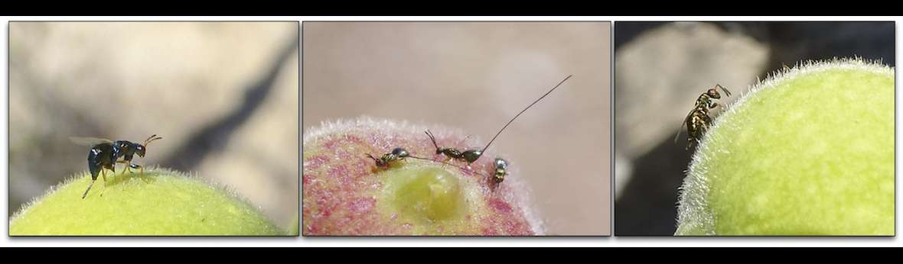

## Quick review of simple linear regression

```{r, echo = FALSE}
library(knitr);
library(faraway);
```

```{r, echo = FALSE}

```


## Quick review of simple linear regression

Fig trees in Baja, Mexico are visted by several species of wasps

```{r, echo = FALSE, out.width="100%"}

```

Wasps use their ovipositors to drill into the side of the enclosed inflorescence (syconia, or colloquially "fruit")

## Quick review of simple linear regression

```{r, echo = FALSE}
Het1 <- read.csv("Het1.csv");
mod1 <- lm(Body_size ~ Volume, data = Het1);
mody <- predict(mod1)
par(mar = c(5, 5, 1, 1));
plot(x = Het1$Volume, y = Het1$Body_size, pch = 20, cex.lab = 1.5, 
     cex.axis = 1.25, xlab = expression(paste("Fruit volume (mm"^"3",")")),
     ylab = expression(paste("Female wasp body volume (mm"^"3",")")), cex = 1.25);
```

## Quick review of simple linear regression

```{r, echo = FALSE}
Het1 <- read.csv("Het1.csv");
mod1 <- lm(Body_size ~ Volume, data = Het1);
mody <- predict(mod1)
par(mar = c(5, 5, 1, 1));
plot(x = Het1$Volume, y = Het1$Body_size, pch = 20, cex.lab = 1.5, 
     cex.axis = 1.25, xlab = expression(paste("Fruit volume (mm"^"3",")")),
     ylab = expression(paste("Female wasp body volume (mm"^"3",")")), cex = 1.25);
points(x = Het1$Volume, y = mody, type = "l", lwd = 3);
text(x = 3800, y = 0.2, 
     expression(paste(y[i] == beta[0] + beta[1]*x[i] + epsilon[i])), cex = 3);
```

## Quick review of simple linear regression

```{r, echo = FALSE}
Het1 <- read.csv("Het1.csv");
mod1 <- lm(Body_size ~ Volume, data = Het1);
mody <- predict(mod1)
par(mar = c(5, 5, 1, 1));
plot(x = Het1$Volume, y = Het1$Body_size, pch = 20, cex.lab = 1.5, 
     cex.axis = 1.25, xlab = expression(paste("Fruit volume (mm"^"3",")")),
     ylab = expression(paste("Female wasp body volume (mm"^"3",")")), cex = 1.25);
points(x = Het1$Volume, y = mody, type = "l", lwd = 3);
text(x = 3800, y = 0.2, 
     expression(paste(y[i] == beta[0] + beta[1]*x[i] + epsilon[i])), cex = 3);
for(i in 1:dim(Het1)[1]){
    x0 <- Het1$Volume[i];
    x1 <- Het1$Volume[i];
    y0 <- Het1$Body_size[i];
    y1 <- mody[i];
    points(x = c(x0, x1), y = c(y0, y1), type = "l", lty = "dotted", lwd = 2);
}
```


## Generalising the linear model: error (i.e., residual) structure

**General** linear models assume normally distributed errors

Actual errors can violate the asumption of normality in several ways

```{r, echo = FALSE, fig.height = 5}
x <- rnorm(1000000)
hist(x, breaks = 100, col = "blue", main = "", lwd = 2, 
     xlab = "Residual around the predictive value");
```

Strong skew, kurtosis, Strict bounds (e.g., values between 0 and 1 as shown earlier, predicted values never below zero as with counts)

## Common problems of general linear models

**What if the response ($y$) variable residuals do not fit general linear model assumptions? This can happen under the following conditions:**

- Residuals ($\epsilon$) do not have a constant variance across $x$ values (heteroscadisticity)
- Residuals ($\epsilon$) are not normally distributed \pause

**Four situations of interest$^1$:**

1. Count data
2. Proportion data
3. Binary responses
4. "Time to event" data

\begin{footnotesize}
\footnotetext[1]{Logan, M. 2011. {\it Biostatistical design and analysis using R: a practical guide}. John Wiley \& Sons.}
\end{footnotesize}

## A concrete example: fig wasp survival

\begin{columns}
\begin{column}{0.35\textwidth}  
    \begin{center}
    \begin{itemize}
     \item[] \includegraphics{het1_syc.png} \vspace{5 mm}
     \item[] \includegraphics[width=70px]{Male2.jpg} \vspace{5 mm}
     \item[] \includegraphics{Male1.jpg} 
     \end{itemize}
     \end{center}
\end{column}
\begin{column}{0.65\textwidth}
\begin{itemize}
\setlength\itemsep{1em}
\item Female {\it Heterandrium} wasps can produce two types of males
\item Winged males disperse from their natal fruit to mate
\item Wingless males engage in combat within fruit for access to females \pause
\item {\bf Do bigger wingless males have a higher probability of survival?}
\end{itemize}
\end{column}
\end{columns}

## Fig wasp survival data

\Large

```{r, echo = FALSE}
huse  <- read.csv("het_heads.csv");
huse1 <- huse[,-2];
rownames(huse1) <- NULL;
huse2 <- as.matrix(huse1);
scrmb <- sample(1:dim(huse2)[1], size = dim(huse2)[1], replace = FALSE);
kable(huse2[scrmb[1:9], ]);
```

## Fig wasp survival data

```{r, echo = FALSE}
lmd  <- lm(Survival ~ head_width_mm, data = huse);
xpr  <- seq(from = 600, to = 790, by = 1);
ypr  <- as.numeric(lmd$coefficients[1]) + as.numeric(lmd$coefficients[2]) * xpr;
par(mar = c(5, 5, 1, 1));
plot(x = huse$head_width_mm, y = huse$Survival, xlim = c(580, 800), 
     ylim = c(-0.2, 1.25), pch = 20,
     xlab = expression(paste("Wingless male head width (mm)")), cex = 1.5,
     ylab = "Wingless male survival", cex.lab = 1.5, cex.axis = 1.5, 
     type = "n");
```

## Fig wasp survival data

```{r, echo = FALSE}
par(mar = c(5, 5, 1, 1));
plot(x = huse$head_width_mm, y = huse$Survival, xlim = c(580, 800), 
     ylim = c(-0.2, 1.25), pch = 20,
     xlab = expression(paste("Wingless male head width (mm)")), cex = 1.5,
     ylab = "Wingless male survival", cex.lab = 1.5, cex.axis = 1.5);
```


## Fig wasp survival data

```{r, echo = FALSE}
par(mar = c(5, 5, 1, 1));
plot(x = huse$head_width_mm, y = huse$Survival, xlim = c(580, 800), 
     ylim = c(-0.2, 1.25), pch = 20,
     xlab = expression(paste("Wingless male head width (mm)")), cex = 1.5,
     ylab = "Wingless male survival", cex.lab = 1.5, cex.axis = 1.5);
text(x = 620, y = 1.1, 
     expression(paste(y[i] == beta[0] + beta[1]*x[i] + epsilon[i])), cex = 2.5);
points(x = xpr, y = ypr, type = "l", lwd = 3);
```

## Fig wasp survival data

```{r, echo = FALSE}
par(mar = c(5, 5, 1, 1));
plot(x = huse$head_width_mm, y = huse$Survival, xlim = c(580, 800), 
     ylim = c(-0.2, 1.25), pch = 20,
     xlab = expression(paste("Wingless male head width (mm)")), cex = 1.5,
     ylab = "Wingless male survival", cex.lab = 1.5, cex.axis = 1.5);
text(x = 620, y = 1.1, 
     expression(paste(y[i] == beta[0] + beta[1]*x[i] + epsilon[i])), cex = 2.5);
points(x = xpr, y = ypr, type = "l", lwd = 3);
for(i in 1:dim(huse)[1]){
    x0 <- huse$head_width_mm[i];
    x1 <- huse$head_width_mm[i];
    y0 <- huse$Survival[i]
    y1 <- as.numeric(lmd$coefficients[1]) + as.numeric(lmd$coefficients[2])*x1;
    points(x = c(x0, x1), y = c(y0, y1), type = "l", lty = "dotted", lwd = 2);
}
```


## Using the logit link function

```{r, echo = FALSE}
par(mar = c(5, 5, 1, 1));
plot(x = huse$head_width_mm, y = huse$Survival, xlim = c(580, 800), 
     ylim = c(-0.2, 1.25), pch = 20,
     xlab = expression(paste("Wingless male head width (mm)")), cex = 1.5,
     ylab = "Wingless male survival", cex.lab = 1.5, cex.axis = 1.5);
text(x = 620, y = 1.1, 
     expression(paste(y[i] == beta[0] + beta[1]*x[i] + epsilon[i])), cex = 2.5);
ghus <- glm(Survival ~ head_width_mm, family = "binomial", data = huse);
prd  <- predict(ghus, type = "response")
for(i in 1:dim(huse)[1]){
    x0 <- huse$head_width_mm[i];
    x1 <- huse$head_width_mm[i];
    y0 <- huse$Survival[i]
    y1 <- prd[i];
    points(x = c(x0, x1), y = c(y0, y1), type = "l", lty = "dotted", lwd = 2);
}
newd <- seq(from = 580, to = 800, by = 0.001);
prdp <- predict(ghus, list(head_width_mm = newd), type = "response")
points(x = newd, y = prdp, type = "l", lwd = 3);
```


## Using the logit link function

\hrule

The logit link function linearises the binomial probability function

$$\ln\left(\frac{p}{1-p}\right) = \beta_0 + \beta_1 x$$

\hrule \pause

```{r, echo = FALSE, fig.height = 5}
par(mar = c(5, 5, 1, 1), mfrow = c(1, 2));
plot(x = huse$head_width_mm, y = huse$Survival, xlim = c(580, 800), 
     ylim = c(-0.2, 1.25), pch = 20, type = "n",
     xlab = expression(paste("Wingless male head width (mm): ",beta[1])), 
     cex = 1.5, ylab = "Wingless male survival: p", cex.lab = 1.5, 
     cex.axis = 1.5);
ghus <- glm(Survival ~ head_width_mm, family = "binomial", data = huse);
prd  <- predict(ghus, type = "response")
newd <- seq(from = 580, to = 800, by = 0.001);
prdp <- predict(ghus, list(head_width_mm = newd), type = "response")
points(x = newd, y = prdp, type = "l", lwd = 3);

plot(x = huse$head_width_mm, y = huse$Survival, xlim = c(580, 800), 
     ylim = c(-20, 20), pch = 20, type = "n",
     ylab = expression(paste("logit: ln(p/(1-p))")), cex = 1.5,
     xlab = expression(paste("Wingless male head width (mm): ",beta[1])), 
     cex.lab = 1.5, cex.axis = 1.5);
ghus <- glm(Survival ~ head_width_mm, family = "binomial", data = huse);
prd  <- predict(ghus, type = "link")
newd <- seq(from = 580, to = 800, by = 0.001);
prdp <- predict(ghus, list(head_width_mm = newd), type = "link")
points(x = newd, y = prdp, type = "l", lwd = 3);
```


## Using the logit link function

\Large

```{r, echo = FALSE}
kable(huse2[scrmb[1:9], ]);
```


## Generalised linear model in R

\footnotesize

```{r}
dat  <- read.csv("het_heads.csv");
ghus <- glm(formula = Survival ~ head_width_mm, 
            family  = binomial(link = "logit"), data = huse);
print(ghus);
```


## Generalised linear model in R

```{r, echo = FALSE}
B0 <- round(as.numeric(ghus$coefficients[1]), digits = 4);
B1 <- round(as.numeric(ghus$coefficients[2]), digits = 4);
par(mar = c(5, 5, 1, 1));
plot(x = huse$head_width_mm, y = huse$Survival, xlim = c(580, 800), 
     ylim = c(-0.2, 1.25), pch = 20,
     xlab = expression(paste("Wingless male head width (mm)")), cex = 1.5,
     ylab = "Wingless male survival", cex.lab = 1.5, cex.axis = 1.5);
text(x = 700, y = 1.2, cex = 2.5,
     labels = paste("ln(p/(1-p)) = ", B0, " + ", B1, "x", sep = ""));
ghus <- glm(Survival ~ head_width_mm, family = "binomial", data = huse);
prd  <- predict(ghus, type = "response");
for(i in 1:dim(huse)[1]){
    x0 <- huse$head_width_mm[i];
    x1 <- huse$head_width_mm[i];
    y0 <- huse$Survival[i]
    y1 <- prd[i];
    points(x = c(x0, x1), y = c(y0, y1), type = "l", lty = "dotted", lwd = 2);
}
newd <- seq(from = 580, to = 800, by = 0.001);
prdp <- predict(ghus, list(head_width_mm = newd), type = "response")
points(x = newd, y = prdp, type = "l", lwd = 3);
```


## Generalised linear model in R

```{r, echo = FALSE}
B0 <- round(as.numeric(ghus$coefficients[1]), digits = 4);
B1 <- round(as.numeric(ghus$coefficients[2]), digits = 4);
par(mar = c(5, 5, 1, 1));
plot(x = huse$head_width_mm, y = huse$Survival, xlim = c(580, 800), 
     ylim = c(-0.2, 1.25), pch = 20,
     xlab = expression(paste("Wingless male head width (mm)")), cex = 1.5,
     ylab = "Wingless male survival", cex.lab = 1.5, cex.axis = 1.5);
text(x = 700, y = 1.2, cex = 2.5,
     labels = paste("ln(p/(1-p)) = ", B0, " + ", B1, "x", sep = ""));
ghus <- glm(Survival ~ head_width_mm, family = "binomial", data = huse);
prd  <- predict(ghus, type = "response");
for(i in 1:dim(huse)[1]){
    x0 <- huse$head_width_mm[i];
    x1 <- huse$head_width_mm[i];
    y0 <- huse$Survival[i]
    y1 <- prd[i];
    points(x = c(x0, x1), y = c(y0, y1), type = "l", lty = "dotted", lwd = 2);
}
newd <- seq(from = 580, to = 800, by = 0.001);
prdp <- predict(ghus, list(head_width_mm = newd), type = "response")
points(x = newd, y = prdp, type = "l", lwd = 3);
mdi <- which(abs(prd-0.5) == min(abs(prd-0.5)));
points(x = huse$head_width_mm[mdi], prd[mdi], col = "red", pch = 20, cex = 3);
```

## What the link function is doing

```{r, echo = FALSE}
B0 <- round(as.numeric(ghus$coefficients[1]), digits = 4);
B1 <- round(as.numeric(ghus$coefficients[2]), digits = 4);
par(mar = c(5, 5, 1, 1));
plot(x = huse$head_width_mm, y = huse$Survival, xlim = c(580, 800), 
     ylim = c(-0.2, 1.25), pch = 20,
     xlab = expression(paste("Wingless male head width (mm)")), cex = 1.5,
     ylab = "Wingless male survival", cex.lab = 1.5, cex.axis = 1.5);
text(x = 700, y = 1.2, cex = 2.5,
     labels = paste("ln(p/(1-p)) = ", B0, " + ", B1, "x", sep = ""));
ghus <- glm(Survival ~ head_width_mm, family = "binomial", data = huse);
prd  <- predict(ghus, type = "response");
for(i in 1:dim(huse)[1]){
    x0 <- huse$head_width_mm[i];
    x1 <- huse$head_width_mm[i];
    y0 <- huse$Survival[i]
    y1 <- prd[i];
    points(x = c(x0, x1), y = c(y0, y1), type = "l", lty = "dotted", lwd = 2);
}
newd <- seq(from = 580, to = 800, by = 0.001);
prdp <- predict(ghus, list(head_width_mm = newd), type = "response");
points(x = newd, y = prdp, type = "l", lwd = 3);
mdi <- which(abs(prd-0.5) == min(abs(prd-0.5)));
points(x = huse$head_width_mm[mdi], prd[mdi], col = "red", pch = 20, cex = 3);
arrows(x0 = huse$head_width_mm[mdi], x1 = huse$head_width_mm[mdi],
       y0 = prd[mdi], y1 = -0.25, length = 0.2, lwd = 2, col = "red");
arrows(x0 = huse$head_width_mm[mdi], x1 = 572,
       y0 = prd[mdi], y1 = prd[mdi], length = 0.2, lwd = 2, col = "red");
text(x = 725, y = -0.15, cex = 1.75, col = "red",
     labels = paste("x = ", huse$head_width_mm[mdi], sep = ""));
text(x = 600, y = prd[mdi] + 0.05, cex = 1.75, col = "red",
     labels = paste("p = ", round(prd[mdi], digits = 5), sep = ""));
```


## What the link function is doing

```{r, echo = FALSE}
B0 <- as.numeric(ghus$coefficients[1]);
B1 <- as.numeric(ghus$coefficients[2]);
XX <- 691.14828;
YY <- B0 + B1*XX;
P1 <- exp(YY);
pp <- P1/(1+P1);
```


$$ln\left(\frac{p}{1-p}\right) = \beta_{0}+\beta_{1}x$$ 

$$ln\left(\frac{p}{1-p}\right) = `r B0` + `r B1` x$$ \pause

$$ln\left(\frac{`r pp`}{1-`r pp`}\right) = `r B0` + `r B1` (`r XX`)$$ \pause

$$ln\left(\frac{`r pp`}{1-`r pp`}\right) = `r B0 + B1 * XX`$$ \pause


$$ln\left(`r pp/(1-pp)`\right) = `r B0 + B1 * XX`$$


## What the link function is doing

```{r, echo = FALSE}
B0 <- as.numeric(ghus$coefficients[1]);
B1 <- as.numeric(ghus$coefficients[2]);
XX <- 700;
YY <- B0 + B1*XX;
P1 <- exp(YY);
pp <- P1/(1+P1);
```


$$y = `r B0` + `r B1` (`r XX`)$$

$$y = `r B0 + B1 * XX`$$

$$ln\left(\frac{p}{1-p}\right) = `r B0 + B1 * XX`$$

$$\frac{p}{1-p} = e^{`r B0 + B1 * XX`}$$

$$p = \frac{e^{`r B0 + B1 * XX`}}{1 + e^{`r B0 + B1 * XX`}} = `r pp`$$


## Generalising the linear model

\Large

**GLMs: Generalised linear models**

\begin{itemize}
\setlength\itemsep{1em}
\item Not to be confused with {\bf general} linear models (also sometimes called GLMs)
\item have three properties
\begin{enumerate}
\item Error structure (e.g., binomial)
\item Linear predictor (e.g., $-124.79 + 0.1797x$)
\item Link function (e.g., $ln\left(\frac{p}{1-p}\right)$)
\end{enumerate}
\end{itemize}


## Generalising the linear model: error (i.e., residual) structure

**Generalised** linear models are characterised by independent random variables (i.e., $y_1$, $y_2$, ..., $y_n$) with an expected value $E(y_i) = \mu_i$, and a density function (error) **from the exponential family**.

A density function $f(y_i; \theta_i)$ is in the exponential family if it can be expressed as follows,

$$f(y_i; \theta_i) = e^{y_i \theta_i + b(\theta_i) + c(y_i)}.$$

In the above, $\theta_i$ is a parameter of the family.

Statistical distributions in the exponential family include the Poisson, binomial, exponential, and gamma (also the normal).

\begin{footnotesize}
\footnotetext[1]{Rencher, AC, \& Schaalje, GB. 2008. {\it Linear models in statistics}. John Wiley \& Sons, 446-448.}
\footnotetext[2]{Nelder, JA, \& Wedderburn, RW. 1972. Generalized linear models. {\it Journal of the Royal Statistical Society: Series A (General)}, 135:370-384.}
\end{footnotesize}


## Generalising the linear model: error (i.e., residual) structure

\Large

**There are four common error structures:**

1. Poisson errors (for count data)
2. Binomial errors (for proportion data)
3. Exponential errors (for time to event)
4. Gamma errors (for data with constant coefficient of variation)

## Generalising the linear model: linear predictor

The linear predictor ($\eta$) is the sum of linear effects of 1 or more explanatory variables ($\beta$),

$$\eta = \beta_{0} + \beta_{1} x_{i1} + ... + \beta_{k} x_{ik}.$$

\vspace{10mm}

GLMs compare a *transformed* value from $\eta$ to observations:

- The transformation is specified by the link function (see next)
- The fitted value is the predicted value multiplied by the reciprocal of the link function

## Generalising the linear model: link function

The link function describes how the expected value of the response variable ($\mu_i$) relates to $\eta$,

$$g(\mu_i) = \eta.$$

- Note that this relates the **mean** of a response variable (i.e., $E(y_i) = \mu_i$) to the linear predictor; it is not transforming individual values of $y_i$. \pause

- The model prediction is not $E(y_i)$, except in the special case of the *identity link* (i.e., $g(\mu_i) = \mu_i = \eta$); i.e., a general linear model.

## Linear predictors and link functions

Common GLMs and associated canonical link-distribution pairs.$^{1}$

| **Model**           | **Response variable** | **Predictor variable(s)** | **Residual dist.** | **Link**                 |
|---------------------|-----------------------|---------------------------|---------------------------|--------------------------|
| Linear regression   | Continuous            | Continuous/ categorical   | Gaussian (normal)         | Identity $g(\mu) = \mu$  | 
| | | | | |
| Logistic regression | Binary                | Continuous/ categorical   | Binomial                  | Logit $g(\mu) = \ln\left(\frac{\mu}{1-\mu}\right)$ | 
| | | | | |
| Log-linear models   | Counts                | Categorical               | Poisson         | Log $g(\mu) = \ln\left(\mu\right)$  |


\begin{footnotesize}
\footnotetext[1]{Logan, M. 2011. {\it Biostatistical design and analysis using R: a practical guide}. John Wiley \& Sons.}
\end{footnotesize}

## Linear predictors and link functions

Common GLMs and associated canonical link-distribution pairs.$^{1}$

| **Model**           | **R glm argument**                       |
|---------------------|------------------------------------------|
| Linear regression   | `family = gaussian(link = "identity")`   | 
|                     |                                          |
| Logistic regression | `family = binomial(link = "logit")`      | 
|                     |                                          |
| Log-linear models   | `family = poisson(link = "log")`         |


```{r, eval = FALSE}
ghus <- glm(formula = Survival~head_width_mm, 
            family = binomial(link = "logit"), 
            data = huse);
```

\begin{footnotesize}
\footnotetext[1]{Logan, M. 2011. {\it Biostatistical design and analysis using R: a practical guide}. John Wiley \& Sons.}
\end{footnotesize}


## Further reading suggestions

- Logan, M. 2011. *Biostatistical design and analysis using R: a practical guide*. John Wiley & Sons. **(Chapter 17)**
- Crawley, MJ. 2012. *The R book*. John Wiley \& Sons. **(Chapters 13, 14, 16)**
- Generalised Linear Mixed Models: http://glmm.wikidot.com
- Rencher, AC, \& Schaalje, GB. 2008. *Linear models in statistics*. John Wiley \& Sons, 446-448.
- Nelder, JA, \& Wedderburn, RW. 1972. Generalized linear models. *Journal of the Royal Statistical Society: Series A (General)*, 135:370-384. [[PDF]](https://www.jstor.org/stable/pdf/2344614.pdf?casa_token=VHKchYH85SYAAAAA:x-ZXXTC2hPI50vwk7M8cwd-lwT566e-WSPX-MI3tFDrSGmn0rJYXd-DzHxyW0cUgd05Noz9S1Cx0wZB-zq7jJvSSTfOwTK8YR0IDrKzrQVXUbgSBeCHs)
- [Generalized Linear Models undertanding the link function](https://www.r-bloggers.com/2018/10/generalized-linear-models-understanding-the-link-function/). 15 OCT 2018. Bluecology blog.

